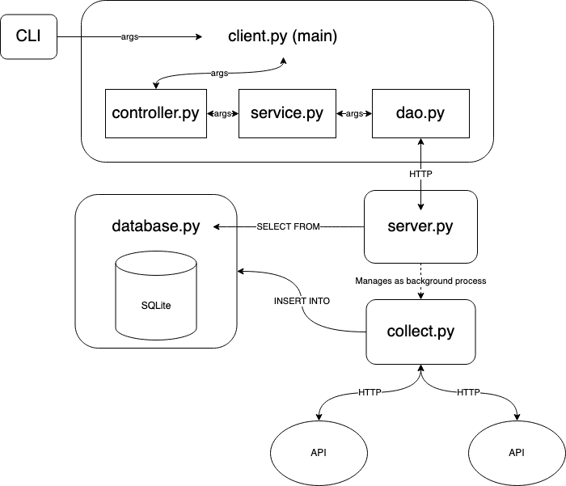

# Introduction
This app is a Trading Server and Simple Client Interface using the CLI. It is meant as a simple tool for storing stock data on a server and having a CLI tool to interact with said collected data. The application consists of 2 main software. The entire app follows the Client-Server architecture, where software 1 is the trading server, and software 2 is the client interface. The trading server is connected to a SQLite database to store data collected from api's using HTTP. The client software is implemented following a MVC design pattern. This project can easily be expanded upon using this design in the future.

## API's
```
# Source 1
https://www.alphavantage.co/documentation/

# Source 2
https://finnhub.io/docs/api/quote
```

# Quick Start
```bash
# start server (default 127.0.0.1:8000)
# will collect data for ticker 'AAPL'
python3 server.py

# connect to server (default 127.0.0.1:8000)
python3 client.py
```


### Server flags
```
# Download data for all the US tickers specified. If not specified, the server will download data for ticker 'AAPL'. (Max of 3 tickers)
--tickers ticker1[, ticker2[, ticker3]]

# Specifies the network port for the server. This argument is optional, and the default port is 8000.
--port XXXX

# If specified, the server will load historical data from the reload file instead of querying from Source 1
--reload filename.cc

# It specifies the sample data being downloaded. It only accepts (5, 15, 30, 60) as inputs, and default value is 5.
--minutes XX
```

### Client flags
```
# query server for latest price available as of the time specified. The time queried is expected to be in UTC time.
--price YYYY-MM-DD-HH-MM

# query server for latest trading signal available as of the time specified. The queried is expected to be in UTC time.
--signal YYYY-MM-DD-HH:MM

# Connect to server running on the IP address, and use specified port number. If not specified, client assumes that the server is running on 127.0.0.1:8000
--server_address XXX.XXX.XXX.XXX:YYYY

# Instruct server to delete a ticker from the server database
# Returns 0=success, 1=server error, 2=ticker not found
--del_ticker TICKER

# Instruct ther server to add a new ticker to the server database. Server must download historical data for said ticker, and start appending on the next pull
# Returns 0=success, 1=server error, 2=ticker not found
--add_ticker TICKER

# Instructs the server to reset all the data. Server must re-download data and tell client that it was sucessful
# Client exists with return code: 0=success, 1=failure
--reset
```


# Architecture
The entire application follows from the client-server architecture.




## Software 1 (Trading Server: `server.py`)
Software that runs until exited with `Ctrl+C`. The server is connected to a database

## Software 2 (Client Interface: `client.py`) 
Follows a 3 layer architecture (MVC) with DAO design pattern.


### Database Modeling

stocks

name   | type   | description
-------|--------|----
ticker | text   | name of stock
date   | text   | date in format 'year-month-day hour:minute:second'
open   | real   | Open price of the day
high   | real   | High price of the day
low    | real   | Low price of the day
close  | real   | Closing price of the day


# Testing
N/A

# Improvements
* Use postgres instead of SQLite
* Use Docker for easier distribution
